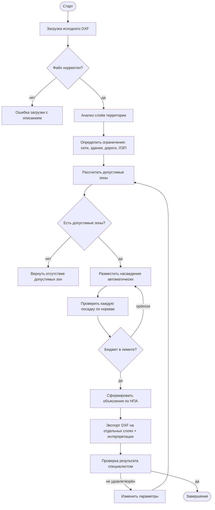

# Схема процесса (flowchart, эквивалент BPMN)

```mermaid
flowchart TD
A([Старт]) --> B[Загрузка исходного DXF]
B --> C{Файл корректен?}
C -- нет --> E[Ошибка загрузки с описанием]
C -- да --> D[Анализ слоёв территории]
D --> F[Определить ограничения: сети, здания, дороги, ЛЭП]
F --> G[Рассчитать допустимые зоны]
G --> H{Есть допустимые зоны?}
H -- нет --> I[Вернуть отсутствие допустимых зон]
H -- да --> J[Разместить насаждения автоматически]
J --> K[Проверить каждую посадку по нормам]
K --> L{Бюджет в лимите?}
L -- optimize --> J
L -- да --> M[Сформировать объяснения по НПА]
M --> N[Экспорт DXF на отдельных слоях + интерпретации]
N --> O[Проверка результата специалистом]
O -- не удовлетворён --> P[Изменить параметры] --> G
O -- да --> Q([Завершение])
```